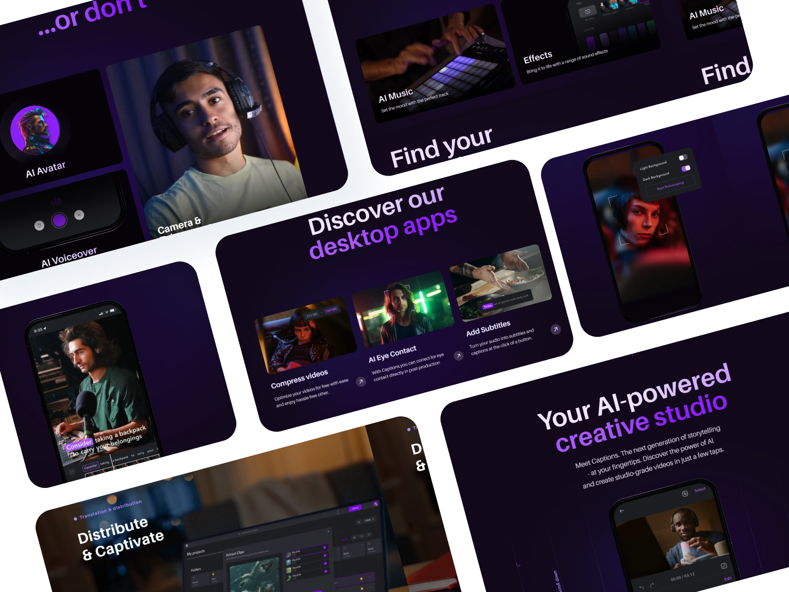
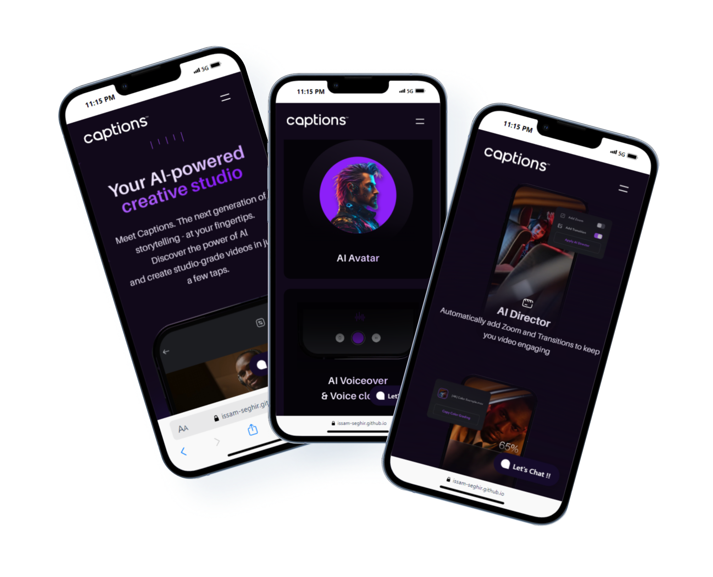

<h1 align="center" >Captions AI</h1>

  

  "Captions | Your AI-powered creative studio"

  This is a **clone** of the [Captions ai](https://www.captions.ai) Landing page  website ,
based on **Gsap** / **Lotties**  animations

its even more  **performance** and **Accessible** then the original website , see [original website score](https://i.imgur.com/fCqSHnk.png)

If you appreciate it, please consider giving it a star ⭐
  
     
    <a href="https://issam-seghir.github.io/Captions-AI/">View Demo</a>
    .
    <a href="https://github.com/issam-seghir/Captions-AI/issues">Report Bug</a>
    .
    <a href="https://github.com/issam-seghir/Captions-AI/pulls">Request Feature</a>
  

 

 

 

<!--  -->

### Built With

  
  
  

## Tools

- [Gsap](https://greensock.com/gsap/) & scrollTrigger plugin for scrolling animation
- [Lottie](https://lottiefiles.com/) animation
- [rfs](https://github.com/twbs/rfs)  for Automates  responsive resizing
- [lenis](https://github.com/studio-freight/lenis) fro smooth scrolling experience
- [gerillass](https://gerillass.com/) mixins library
- postcss plugins : postcss-preset-env / postcss-inline-svg

<!-- CONTRIBUTING -->
## Contributing

Contributions are what make the open source community such an amazing place to learn, inspire, and create. Any contributions you make are **greatly appreciated**.

If you have a suggestion that would make this better, please fork the repo and create a pull request. You can also simply open an issue with the tag "enhancement".
Don't forget to give the project a star! Thanks again!

1. Fork the Project
2. Create your Feature Branch (`git checkout -b feature/AmazingFeature`)
3. Commit your Changes (`git commit -m 'Add some AmazingFeature'`)
4. Push to the Branch (`git push origin feature/AmazingFeature`)
5. Open a Pull Request

<!-- LICENSE -->
## License

Distributed under the MIT License. See `LICENSE.txt` for more information.

## State

## Support Me

